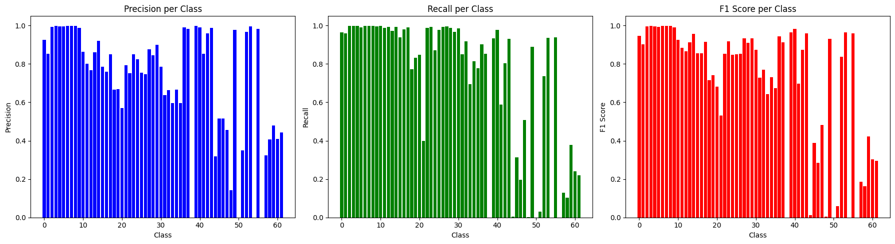

# Letters and Digits Classification (EMNIST)

This project aims to demonstrate the application of machine learning techniques to a specific problem: **handwritten character recognition using the EMNIST dataset**. The project utilizes a custom designed Convolutional Neural Network (CNN) architecture implemented in PyTorch to achieve this goal, is compared against the performance of a ResNet34 model trained on the same dataset, and then deployed with Streamlit.

**Streamlit App:** https://cemnist.streamlit.app


## Features

- Data preprocessing and label standardization
- Implementation of a custom and ResNet-based CNN
- Training and evaluation on the EMNIST dataset
- Hyperparameter tuning and optimization
- Visualization of training progress and results
- Deployment of model onto interactive website

## Metrics

Hyperparameter | Custom CNN | ResNet34
--- | --- | --- |
**Loss Function** | CrossEntropyLoss | CrossEntropyLoss
**Optimizer** | Adam | Adam
**Learning Rate** | 0.001 | 0.001
**Scheduler** | ExponentialLR | ExponentialLR
**Epochs Trained** | 20 | 15
**Batch Size** | 128 | 128

Metric | Custom CNN | ResNet34
--- | --- | --- |
**Loss** | 0.2957 | 0.3051
**Accuracy** | 0.9004 | 0.8812
**Precision** | 0.8816 | 0.8639
**Recall** | 0.9004| 0.8812
**F1** | 0.8850 | 0.8609


One metric very interesting to measure was each of the model's performance in classifying specific classes. Below is a graph showing the model's performance on specifying different classes with different metrics.




Clearly, both models performance for the first half of the classes is exception with performance faltering more as you approach the later half of the classes. In context the first half of consists of the digits 0 - 9 and captalized letters (A - Z) while the second consist of some capitalized letters (A-Z) and all of the lowercase letters (a-z). This shows that some problems exist in the data itself that causes models to not predict lowercase letters as accurately and that the performance can be improved by performing more data preprocessing and data augmentation. 


## Installation

### Prerequisites

- Python 3.8 or higher
- [PyTorch](https://pytorch.org/get-started/locally/) (version X.X.X)
- [NumPy](https://numpy.org/)
- [Pandas](https://pandas.pydata.org/)
- [Matplotlib](https://matplotlib.org/)
- [scikit-learn](https://scikit-learn.org/stable/)
- [tqdm](https://tqdm.github.io/)
- [torchvision](https://pypi.org/project/torchvision/)

### Clone the Repository

```bash
git clone https://github.com/yourusername/your-repo-name.git
cd your-repo-name
```
## Install Dependencies

You can install the required dependencies using pip:

```bash
pip install -r requirements.txt
```

## Project Process
<details>
<summary>Dataset</summary>

### Dataset

The EMNIST (Extended MNIST) dataset is an extension of the original MNIST dataset, designed to offer a broader range of handwritten character images. This combined version merges various EMNIST splits to create a comprehensive dataset that includes:

  * Digits: Handwritten digits (0-9).
  * Uppercase Letters: Uppercase letters (A-Z).
  * Lowercase Letters: Lowercase letters (a-z).

Dataset Specifications:

  * Classes: 62 (including digits, uppercase letters, and lowercase letters)
  * Total Samples: [Insert total number of samples here]
  * Image Size: 28x28 pixels
  * Color: Grayscale (1 Channel) 

The EMNIST dataset was downloaded from the [NIST website](https://www.nist.gov/itl/products-and-services/emnist-dataset), unzipped, and stored in the `data/EMNIST/raw` directory.
</details>
<details>
<summary> Data preprocessing </summary>

### Data preprocessing
**``data_preprocessing.py`` File**

Function List and Descriptions
1. ``gather_data``
   * **Purpose**: Collects training and testing datasets from various EMNIST splits with necessary transformations.
   * **Returns**: A list containing training datasets and testing datasets.
2. ``standardizing_label_ranges``
   * **Purpose**: Standardizes label ranges across different EMNIST splits for consistency.
   * **Parameters**: `datasets` List or dataset to be standardized.
   * **Returns**: Standardized datasets.
3. ``combining_datasets``
   * **Purpose**: Combines multiple datasets into one using PyTorch's ConcatDataset.
   * **Parameters**: `datasets` List of datasets to be combined.
   * **Returns**: Combined ConcatDataset

**Explanations:**
#### Loading in data
TorchVision's EMNIST loader was used to load in the data from previously specified directory. Usually, torchvision loads in the EMNIST dataset by a particular split as the EMNIST dataset is structured into different categories or spits. However, as the project was focusing on combining both digits and letters (both capitalized and uncapitalized), all six splits available in the EMNIST dataset were loaded in. The next step would have been to combine all the datasets. However, there was a specific issue found when combining the datasets.

#### Standardizing Labels


Since the different splits were combined together and each split had its own set of labels, labels for the same class would not match together. For example, the `letters` split would classify the letter `a` with the label of `1` but the `byClass` split (with both capitlized and uncapitalized letters) would label the letter `a` with `36`. This occured because the `letters` split only contained images of lowercase letters but the `byClass` split

An example is shown below. The `byClass` split and the `letters` split both have different labels for the same letter: `a`. 


This posed an issue as the same letters would end up having different labels throughout the entire dataset leading to the model learning the wrong patterns and mappings. To fix this, a standardized label set needed to be made to which each split would be mapped to.

A standardized label set was made starting from the digits 0 - 9 (mapped to 0 to 9) going to the capitalized letters A - Z (mappled to 10 - 35) and ending off with lowercase letters a - z (mapped to 36 - 61).

Then, for each dataset:
    * a dictionary was made by mapping each class of the dataset to the index of where the class existed in the standardized label set.
    * the labels for each entry in the dataset was rewritten to the mapping done in the dictionary in the previous step
  
This effectively solved the problem of the varying label ranges for the datasets. After this standardization, all the splits could be combined together with no issue. 

The eample from above is show below but now with the fixed labels:


The combined datasets for both the trian and test sets were saved to the directory `data/EMNIST/processed`.

#### Splitting dataset

**`data_split.py` File**

**Function List and Descriptions**

1. **`split_data`**
   * **Purpose**: Splits a given dataset into training and validation sets based on specified ratios.
   * **Parameters**: 
     * `dataset` - The dataset (`ConcatDataset` or `Dataset`) to be split.
   * **Returns**: A list containing the training and validation datasets.

2. **`main`**
   * **Purpose**: Manages the loading, splitting, and saving of datasets.
   * **Steps**:
     1. Loads combined training and testing datasets.
     2. Splits the combined training dataset into training and validation sets.
     3. Saves the resulting training, validation, and testing datasets.

**Explanations:**

The train dataset was split to create a training and validation set. 90% of the dataset was used for training and 10% was used for validation. The test dataset remained unchanged.
</details>

<details>
    <summary>Model training</summary>


### Model training
**`model_training.py` File**

**Function List and Descriptions**

1. **`training_loop`**
   - **Purpose**: Performs the training process for one epoch.
   - **Parameters**:
     - `device` (str): Device to train the model on ('cuda' or 'cpu').
     - `model` (torch.nn.Module): The model to train.
     - `epoch` (int): Current epoch number.
     - `train_loader` (DataLoader): DataLoader for training data.
     - `x_epoch` (list[int]): List to store epoch numbers.
     - `loss_fn` (torch.nn.Module): Loss function to compute loss.
     - `optimizer` (torch.optim.Optimizer): Optimizer for updating model parameters.
     - `y_loss` (dict[str, list[float]]): Dictionary to store training loss values.
   - **Returns**: None

2. **`evaluation_loop`**
   - **Purpose**: Evaluates the model on the validation set.
   - **Parameters**:
     - `device` (str): Device to evaluate the model on ('cuda' or 'cpu').
     - `model` (torch.nn.Module): The model to evaluate.
     - `val_loader` (DataLoader): DataLoader for validation data.
     - `loss_fn` (torch.nn.Module): Loss function to compute loss.
     - `y_loss` (dict[str, list[float]]): Dictionary to store validation loss values.
     - `accuracy_vals` (list[float]): List to store validation accuracy values.
   - **Returns**: None

3. `main`

   * **Purpose**: Runs the entire model training and evaluation pipeline, including data loading, model initialization, training, evaluation, and saving metrics and the trained model.

   * **Steps**:
     1. **Set Error Handling for NumPy**:
        - Configure NumPy to ignore division errors.
     2. **Determine Device**:
        - Set the computation device to GPU (`cuda:0`) if available; otherwise, default to CPU.
     3. **Set Random Seed**:
        - Initialize the random seed for reproducibility with `torch.manual_seed(42)`.
     4. **Load Preprocessed Data**:
        - Load the preprocessed training and validation datasets from saved files.
     5. **Create Data Loaders**:
        - Initialize DataLoaders for training and validation datasets with a specified batch size and number of workers.
     6. **Initialize Model**:
        - Create an instance of `CustomCNN` and print its summary using `torchsummary`.
     7. **Set Hyperparameters**:
        - Define the loss function (`CrossEntropyLoss`).
        - Set up the optimizer (`Adam`) with a learning rate of 0.001.
        - Configure the learning rate scheduler (`ExponentialLR`) with a decay factor of 0.999.
     8. **Train and Evaluate Model**:
        - Iterate over the specified number of epochs.
        - Call `training_loop` to perform training for each epoch.
        - Call `evaluation_loop` to evaluate the model on the validation set after each epoch.
        - Update the learning rate using the scheduler.
     9. **Visualize Model Metrics**:
        - Save plots of training and validation loss metrics.
        - Save plots of validation accuracy metrics.
     10. **Save Trained Model**:
         - Create a directory for models if it doesn't exist.
         - Save the trained model's state dictionary to a file.

**Explanations:**

To begin the model training, the train and validation sets were first loaded in and passed through the DataLoader function in PyTorch to batch the data. The batch size used was `128`.
The custom cnn model and the resnet34 model were then initalized. The hyperparameters were set as the following for both models:

    * Loss function: CrossEntropyLoss
    * Optimizer: Adam 
    * Learning rate: 0.001
    * Scheduler = ExponentialLR Scheduler
    * Gamma = 0.999
  
The training and evaluation loops were run for 20 epochs for the custom cnn and for 15 epochs for the resent34 with the scheduler adjusting the learning rate in between each epoch.

Once training was completed, accuracy and loss values were visualized and saved in the `metrics` directory.

`CustomCNN Loss and Accuracy Progression`


`ResNet34 Loss and Accuracy Progression`


</details>

<details>
    <summary>Model evaluation</summary>

### Model evaluation

**`model_evaluation.py` File**

**Function List and Descriptions**

1. **validation_step**
   * **Purpose**: Performs a single validation step on a batch of data. Moves images and labels to the specified device, computes predictions, calculates the loss, and returns a dictionary with validation loss, predictions, and true labels.
   * **Parameters**: 
     - `device` (torch.device): The device to perform computation on.
     - `model` (torch.nn.Module): The model to evaluate.
     - `batch` (tuple): A tuple containing images and labels.
   * **Returns**: A dictionary containing validation loss, predictions, and true labels.

2. **validation_epoch_end**
   * **Purpose**: Aggregates the results of validation steps to compute metrics for the entire epoch. Computes average validation loss, accuracy, precision, recall, and F1 score, as well as per-class metrics. Also generates and plots the confusion matrix.
   * **Parameters**:
     - `outputs` (list of dicts): A list of dictionaries containing loss, predictions, and labels for each batch.
   * **Returns**: A dictionary containing average validation loss, accuracy, precision, recall, F1 score, and per-class metrics.

3. **evaluate**
   * **Purpose**: Evaluates the model on the validation data. Sets the model to evaluation mode, performs validation steps on the data loader, and returns the aggregated metrics.
   * **Parameters**:
     - `device` (torch.device): The device to perform computation on.
     - `model` (torch.nn.Module): The model to evaluate.
     - `val_loader` (DataLoader): DataLoader for the validation dataset.
   * **Returns**: A dictionary containing validation metrics.

4. **main**
   * **Purpose**: Main function to load a trained model, evaluate it, and display metrics. Ensures model and data directories exist, loads the model, loads the test dataset, evaluates the model, prints metrics, and plots precision, recall, and F1 score per class.
   * **Parameters**:
     - `modelName` (str): The filename of the model to evaluate.
   * **Steps**:
     1. Set NumPy to ignore division errors.
     2. Determine the device (GPU or CPU) to use.
     3. Set a random seed for reproducibility.
     4. Ensure the model directory exists and raise an error if not.
     5. Initialize the model and load its weights from the specified file.
     6. Ensure the data directory exists and raise an error if not.
     7. Load the test dataset and create a DataLoader for it.
     8. Evaluate the model using the `evaluate` function and get metrics.
     9. Print validation loss, accuracy, precision, recall, and F1 score.
     10. Create a DataFrame for class metrics and print it.
     11. Plot and save the precision, recall, and F1 score for each class.
   * **Returns**: None. The function prints metrics and plots results.


**Explanations:**

To evaluate the model after training, the model was loaded in and ran on the testing dataset. The test dataset was loaded in and batched with the DataLoader function and a batch size of 128.

The loss and accuracy values are calculated for each batch in the epoch and then aggregated for each epoch by averages. The final values for each epoch are also averaged to find the metrics for loss, accuracy, precision, recall, and F1 score.

Apart from finding the overall metrics, class metrics were also calculated. As there were about 62 different classes, the metrics were also calculated by class to see how the model was predicting on each class. Precision, recall, and accuracy were calculated for class metrics. Plots for class metrics and confusion matrix were also generated and saved.
</details>

## Model Architecture
<details>
    <summary>Architecture Overview</summary>

### Architecture Overview

#### Convolutional Layer 1 (`self.layer1`):
- **Purpose**: Extracts initial features from the input image.
- **Components**:
  - **`Conv2d`**: Applies a 3x3 convolution with 32 output channels. This layer detects low-level features such as edges and textures.
  - **`BatchNorm2d`**: Normalizes the output of the convolution to stabilize and speed up training.
  - **`ReLU`**: Introduces non-linearity, enabling the network to learn complex patterns.
  - **`MaxPool2d`**: Reduces the spatial dimensions (height and width) by taking the maximum value in a 2x2 window, which helps in reducing the computational load and providing some degree of translation invariance.

#### Convolutional Layer 2 (`self.layer2`):
- **Purpose**: Captures more complex features based on the initial feature maps.
- **Components**:
  - **`Conv2d`**: Applies a 3x3 convolution with 64 output channels, allowing the model to learn more complex patterns.
  - **`BatchNorm2d`**: Normalizes the output of the convolution for better training stability.
  - **`ReLU`**: Adds non-linearity to the network, helping in learning more intricate features.

#### Convolutional Layer 3 (`self.layer3`):
- **Purpose**: Extracts even more abstract features from the previous layer's outputs.
- **Components**:
  - **`Conv2d`**: Applies a 3x3 convolution with 128 output channels.
  - **`BatchNorm2d`**: Normalizes the output to ensure stable training.
  - **`ReLU`**: Maintains non-linearity.
  - **`MaxPool2d`**: Further reduces the spatial dimensions to make the network more robust to variations in the input.

#### Convolutional Layer 4 (`self.layer4`):
- **Purpose**: Focuses on high-level feature extraction with deeper layers.
- **Components**:
  - **`Conv2d`**: Applies a 3x3 convolution with 256 output channels, capturing very complex and abstract features.
  - **`BatchNorm2d`**: Ensures stable and effective training.
  - **`ReLU`**: Continues introducing non-linearity.

#### Fully Connected Layer (`self.layer5`):
- **Purpose**: Transforms the high-level features into class scores for classification.
- **Components**:
  - **`Flatten`**: Converts the 3D tensor output from the convolutional layers into a 1D tensor suitable for linear layers.
  - **`Linear`**: A series of fully connected layers (1024 → 512 → 256 → 128 → 64 → 32 → 62) that learn complex combinations of features for classification. The final layer outputs logits for 62 classes, corresponding to the number of classes in the classification task.
</details>

<details>
    <summary>Architecture Code</summary>

### Architecture Code
```python
class CustomCNN(torch.nn.Module):
    """
    A custom convolutional neural network (CNN) model for image classification.
    """
    def __init__(self):
        super().__init__()
        # Convolutional Layer 1: Applies a 3x3 convolution with 32 output channels, followed by batch normalization, ReLU activation, and max pooling
        self.layer1 = torch.nn.Sequential(
            torch.nn.Conv2d(1, 32, kernel_size=3, padding=1),
            torch.nn.BatchNorm2d(32),
            torch.nn.ReLU(inplace=True),
            torch.nn.MaxPool2d(2)
        )
        # Convolutional Layer 2: Applies a 3x3 convolution with 64 output channels, followed by batch normalization and ReLU activation
        self.layer2 = torch.nn.Sequential(
            torch.nn.Conv2d(32, 64, kernel_size=3, padding=1),
            torch.nn.BatchNorm2d(64),
            torch.nn.ReLU(inplace=True)
        )
        # Convolutional Layer 3: Applies a 3x3 convolution with 128 output channels, followed by batch normalization, ReLU activation, and max pooling
        self.layer3 = torch.nn.Sequential(
            torch.nn.Conv2d(64, 128, kernel_size=3, padding=1),
            torch.nn.BatchNorm2d(128),
            torch.nn.ReLU(inplace=True),
            torch.nn.MaxPool2d(2)
        )
        # Convolutional Layer 4: Applies a 3x3 convolution with 256 output channels, followed by batch normalization and ReLU activation
        self.layer4 = torch.nn.Sequential(
            torch.nn.Conv2d(128, 256, kernel_size=3, padding=1),
            torch.nn.BatchNorm2d(256),
            torch.nn.ReLU(inplace=True)
        )
        # Fully Connected Layer: Flattens the input and applies several linear layers with ReLU activations
        self.layer5 = torch.nn.Sequential(
            torch.nn.Flatten(),
            torch.nn.Linear(256 * 7 * 7, 1024),
            torch.nn.ReLU(inplace=True),
            torch.nn.Linear(1024, 512),
            torch.nn.ReLU(inplace=True),
            torch.nn.Linear(512, 256),
            torch.nn.ReLU(inplace=True),
            torch.nn.Linear(256, 128),
            torch.nn.ReLU(inplace=True),
            torch.nn.Linear(128, 64),
            torch.nn.ReLU(inplace=True),
            torch.nn.Linear(64, 32),
            torch.nn.ReLU(inplace=True),
            torch.nn.Linear(32, 62)  # Output layer with 62 classes
        )
        
    def forward(self, x):
        """
        Forward pass through the network.
        
        Args:
            x (torch.Tensor): Input tensor.
        
        Returns:
            torch.Tensor: Output tensor.
        """
        x = self.layer1(x)  # Convolution + BatchNorm + ReLU + MaxPool
        x = self.layer2(x)  # Convolution + BatchNorm + ReLU
        x = self.layer3(x)  # Convolution + BatchNorm + ReLU + MaxPool
        x = self.layer4(x)  # Convolution + BatchNorm + ReLU
        x = self.layer5(x)  # Flatten + Linear layers (with ReLU activations)
        return x

```
</details>

<details>
    <summary>How does a CNN work?</summary>

### CNN Process Breakdown

#### **Convolution**
**Role:** Convolution is the core operation in a convolutional neural network. It involves sliding a filter (or kernel) over the input image and computing dot products between the filter and the local region of the image. This process results in a feature map that highlights specific patterns such as edges or textures.

**Utility:**
- **Feature Extraction:** Each convolutional layer applies multiple filters, allowing the network to detect different features. Early layers often detect simple features (edges, textures), while deeper layers capture more complex features (shapes, objects).
- **Spatial Hierarchies:** By stacking multiple convolutional layers, the network learns hierarchical representations of the input. The initial layers capture low-level features, and subsequent layers build upon these to detect more abstract patterns.
- **Shared Weights:** Convolutional layers use the same filter (weights) across different parts of the image, making them efficient and effective for detecting spatial patterns regardless of their location.

#### **Batch Normalization**
**Role:** Batch normalization normalizes the output of the convolutional layers by adjusting the mean and variance of the activations. This is done using statistics computed from the current mini-batch of data.

**Utility:**
- **Stabilizes Training:** By reducing the internal covariate shift (the change in the distribution of network activations due to parameter updates), batch normalization helps in stabilizing and accelerating the training process.
- **Reduces Overfitting:** By adding a small amount of noise to the activations, batch normalization has a slight regularizing effect, which can reduce overfitting.
- **Improves Convergence:** Normalized activations lead to a more stable and faster convergence, allowing the network to train more efficiently.

#### **ReLU Activation**
**Role:** The Rectified Linear Unit (ReLU) activation function applies a non-linear transformation to the input, outputting the maximum of zero and the input value. This introduces non-linearity into the network.

**Utility:**
- **Non-Linearity:** ReLU helps the network learn complex mappings and represent non-linear decision boundaries, which is crucial for solving complex tasks.
- **Sparsity:** By setting negative values to zero, ReLU introduces sparsity in the activations, which can lead to more efficient learning and reduce the likelihood of overfitting.
- **Avoiding Vanishing Gradient:** Unlike sigmoid or tanh activations, ReLU mitigates the vanishing gradient problem, allowing gradients to propagate effectively through deep networks.

#### **Max Pooling**
**Role:** Max pooling reduces the spatial dimensions (height and width) of the feature maps by taking the maximum value in a defined window (e.g., 2x2). This operation is typically performed after convolutional layers.

**Utility:**
- **Down-Sampling:** By reducing the spatial dimensions, max pooling decreases the computational load and memory usage, making the network more efficient.
- **Translation Invariance:** Max pooling helps in achieving some degree of translation invariance by focusing on the most prominent features in each region of the feature map.
- **Feature Aggregation:** Pooling layers aggregate features from a local region, making the network less sensitive to small translations and distortions in the input.

#### **Flattening**
**Role:** Flattening converts the 3D tensor output from the convolutional and pooling layers into a 1D vector. This step is necessary to feed the data into the fully connected layers.

**Utility:**
- **Preparation for Dense Layers:** Flattening prepares the feature maps for the fully connected layers by transforming the spatially structured data into a linear format.
- **Preservation of Features:** It retains the features learned by the convolutional and pooling layers, allowing the fully connected layers to learn complex relationships and perform classification.

#### **Fully Connected Layers**
**Role:** Fully connected (dense) layers take the flattened feature vector and perform a series of linear transformations to produce the final class scores. Each neuron in a fully connected layer is connected to every neuron in the previous layer.

**Utility:**
- **Combining Features:** Fully connected layers combine features extracted by the convolutional layers into high-level representations. They learn complex combinations of features to make final predictions.
- **Classification:** The final fully connected layer outputs logits corresponding to the number of classes, which are used for classification. This layer determines the class of the input image based on the features learned by the network.

</details>

## Next Steps
* Exploring the reason behind the CNN's inability to classify well on lowercase letters and improving that prediction.
* Tuning different hyperparameters to achieve metrics above 95% to compete with state of the art models.
* Augmenting the dataset with colored channels and chracters written in different colors and with different writing utensils (pencils, pens, crayons, markers, chalk, etc.) on different types of writing boards (paper, whiteboard, blackboard, etc.) to make the model more applicable to be used in real life without modifying the image to be grayscale.

## License

This project is licensed under the GNU General Public License v3.0 (GPL-3.0). See the [LICENSE](LICENSE) file for details.

### Summary

The GNU General Public License (GPL) v3.0 is a free software license that ensures end users have the freedom to run, study, share, and modify the software. It also requires that any modified versions of the software be distributed under the same license terms. For more information, see the full license text.

### Full License Text

You can read the full text of the GPL-3.0 license [here](https://www.gnu.org/licenses/gpl-3.0.html).

## Citations
